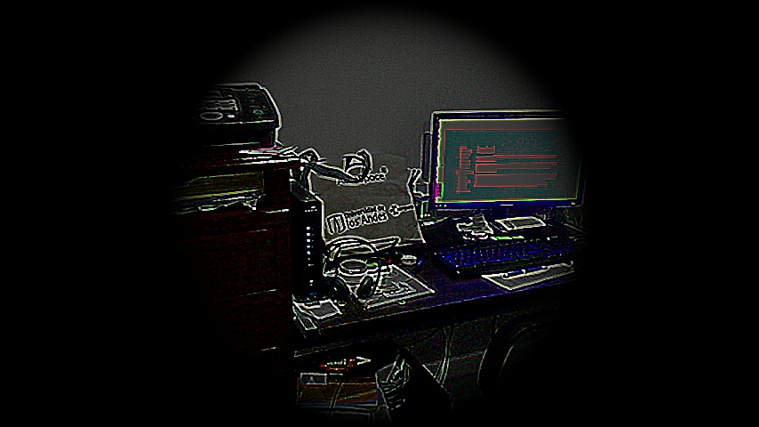
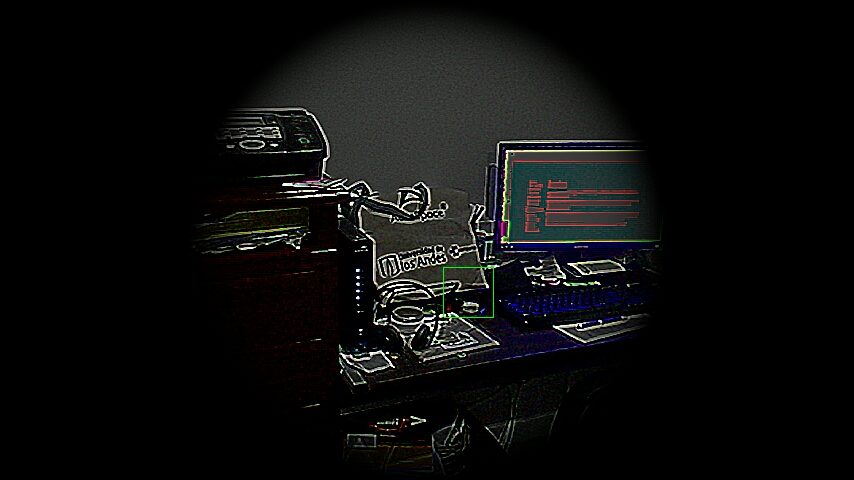
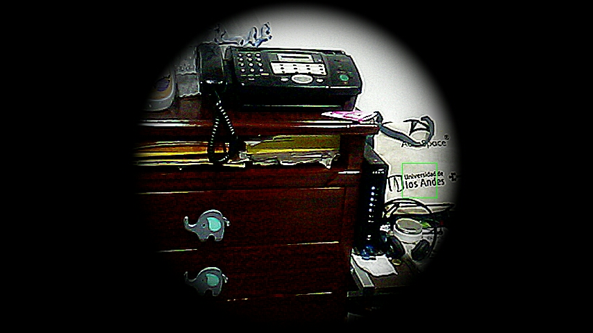

# Entrega final de curso

## Propósito

Desarrollar una aplicación en donde se apliquen los temas de interacción y de shaders.

## Desarrollo

Se realiza una aplicación para el sistema operativo android. Esta se quiere tomar como base para un aplicación que permita agregar marcaciones en tiempo real a un espacio determinado. Con un objetivo de entretención.

Para este trabajo se usa la camara del dispositivo para realizar un texturizado en tiempo real de la imagen que se captura con el fin de dar un aspecto mas rustico y oscuro. Para la realización de este paso se utilizo shaders, implementados usando el lenguaje glsl. La imagen puede ser aclarada por medio de la modificación del shader, que en este caso se realiza por medio de la variable light.

En el aplicativo se puede hacer una marcación de una zona la cual quedara relacionada con una ubicación en particular en el espacio. Por esta razon al mover la camara del celular hacia otro lugar la marcación desaparece y vuelve cuando se regresa a la posición inicial. El celular envia el movimiento que este ha tenido y la aplicación recalcula la posición de los cuadros.

### Interfaz inicial 

### Selección

### Movimiento

## Integrantes

|       Integrante         | github nick                                              |
|--------------------------|----------------------------------------------------------|
| Diego Andrés Baquero     | [diegobaqt](https://github.com/diegobaqt)                |
| Andrés Felipe López      | [andreslopzi](https://github.com/andreslopzi)            |

## Referencias

[1] https://thndl.com/

[2] http://visualcomputing.github.io/Shaders/

[3] https://visualcomputing.github.io/Interaction/

[4] http://ketai.org/

[5] https://github.com/VisualComputing/framesjs/tree/processing/examples/Advanced/SceneBuffers
